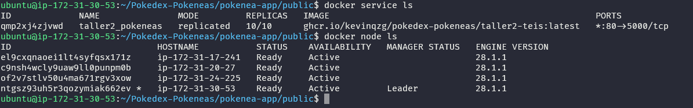
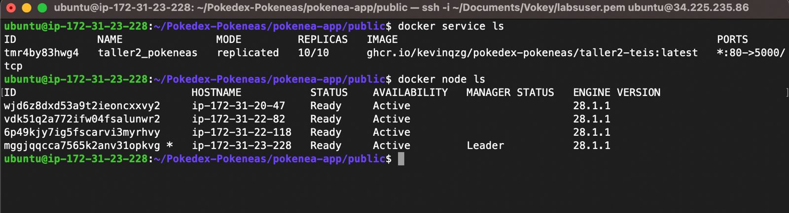
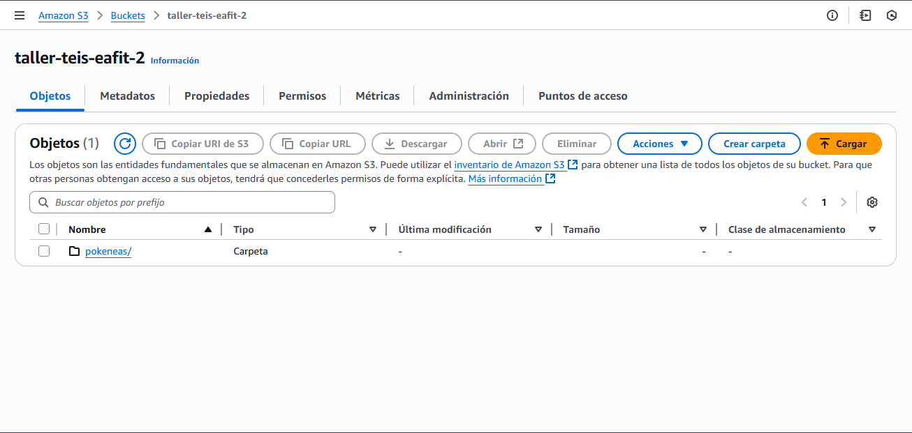
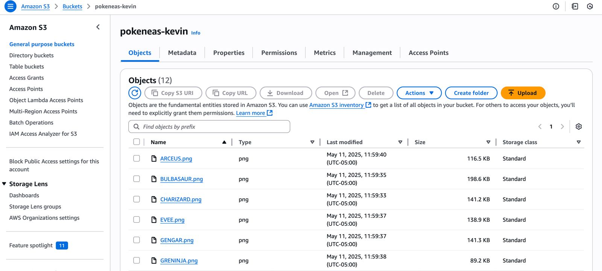
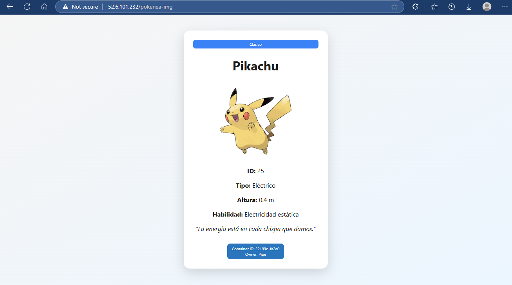
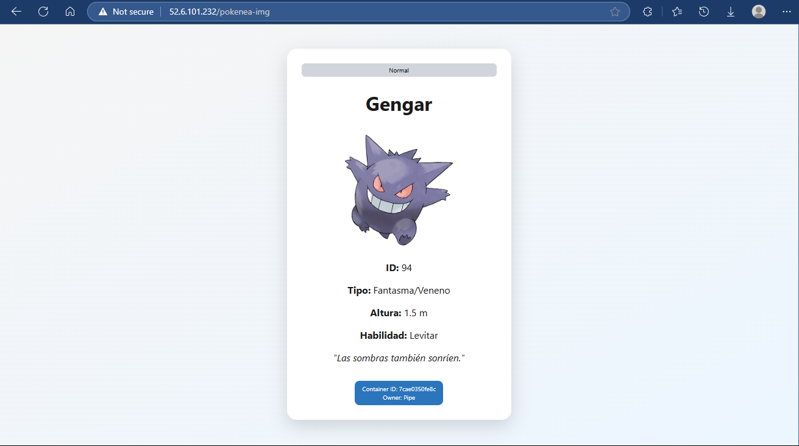
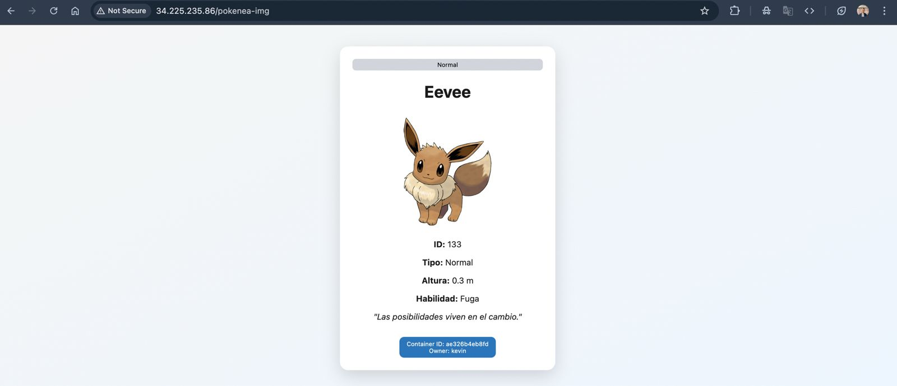
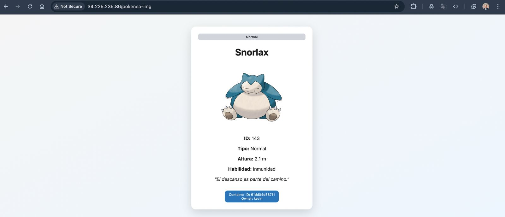

# 🧪 Workshop 02 - Pokeneas Pokedex

This project was developed in pairs for Workshop 02 using **Node.js with Express**, **Docker**, and **AWS EC2**.

## Content Table
- [Participants](#-participants)
- [Project Description](#-project-description)
- [Features](#-features)
- [Tech Stack](#-tech-stack)
- [Project Structure](#-project-structure)
- [Running the App Locally](#-running-the-app-locally)
- [Docker Swarm Deployment](#-docker-swarm-deployment)
- [Application Access](#-application-access)
- [Deliverables](#deliverables)
- [Verification](#-verification)
- [Learn More](#-learn-more)
- [Screenshots](#-screenshots)
- [Website](#-website)


## 👥 Participants

- Kevin Quiroz ([GitHub](https://github.com/KevinQzG))
- Juan Felipe Restrepo ([GitHub](https://github.com/JuanFelipeRestrepoBuitrago))

---

## 📦 Project Description

**Pokenea** is a custom Pokedex inspired by Antioquian culture. Each Pokenea entry includes:

- ID
- Name
- Height
- Skill
- Image (hosted on public Amazon S3 bucket)
- Philosophical phrase
- Rarity level

The frontend is built directly using **EJS templates** with **Tailwind CSS**, ensuring a stylized and lightweight user interface, without requiring React or separate frontend tooling.

---

## 🚀 Features

The system exposes three main routes:

1. **`/`** → Displays all Pokeneas with:
   - Tailwind-styled cards
   - Philosophical phrase
   - Rarity label and container ID

2. **`/pokenea-json`** → Returns a JSON with:
   - Random Pokenea's ID, name, height, skill
   - Container ID

3. **`/pokenea-img`** → Displays a single Pokenea (random) with:
   - Image, phrase, and container ID

---

## ⚙️ Tech Stack

- Node.js + Express
- EJS (Embedded JavaScript templates)
- Tailwind CSS
- Docker + Docker Swarm
- AWS EC2 (1 leader node + 3 manager nodes)
- GitHub Actions (for CI/CD)
- DockerHub
- Amazon S3 (public image hosting)

---

## 📁 Project Structure

```
pokenea-app/
├── public/
│   ├── favicon.png         ← App icon
├── src/
│   ├── routes/
│   │   └── server.js       ← API routes and views logic
│   ├── views/
│   │   └── index.ejs       ← Main EJS view for Pokeneas
├── .env
├── package.json
├── tailwind.config.js
```

---

## 🧪 Running the App Locally

### 1. Clone the Repository

```bash
git clone https://github.com/kevinqzg/Pokedex-Pokeneas.git
cd Pokedex-Pokeneas/pokenea-app
```

### 2. Install Dependencies

```bash
npm install
```

### 3. Run the App

```bash
npm run dev
```

Runs on: `http://localhost:5005`

---

## 🐳 Docker Swarm Deployment

Deployed across 4 EC2 instances:

- 1 Leader node (`docker swarm init`)
- 3 Manager nodes (joined via `docker swarm join`)
- 10 replicas of the app using:

### Bucket Images Upload

1. Create an S3 bucket in AWS.
2. Set the bucket to public access.
   1. In the S3 console, select your bucket.
   2. Go to the "Permissions" tab.
   3. Click the "Edit" button in the "bucket policy" section.
   4. Add the following policy:
```json
{
  "Version": "2012-10-17",
  "Statement": [
    {
      "Effect": "Allow",
      "Principal": "*",
      "Action": "s3:GetObject",
      "Resource": "arn:aws:s3:::your-bucket-name/*"
    }
  ]
}
```
   5. Replace `your-bucket-name` with the name of your S3 bucket.
   6. Click the "Save changes" button.

### Deploy 4 EC2 instances

To deploy the application on AWS, you need to set up three EC2 instances. Follow these steps:

1. Create an AWS account and log in to the AWS Management Console.
2. Navigate to the EC2 Dashboard and launch a new instance.
3. Choose an Ubuntu Server 20.04 LTS AMI.
4. Select an instance type (e.g., t2.micro for free tier).
5. Configure instance details, including network settings and security groups, to allow HTTP (port 80) and HTTPS (port 443) traffic.
6. Create a new key pair or use an existing one to access the instance.
7. Launch the instance and wait for it to be in the "running" state.

### Installing Docker and Docker Compose in all instances

1. Update the package list and install dependencies:
```bash
sudo apt update
sudo apt upgrade -y
sudo apt install -y apt-transport-https ca-certificates curl software-properties-common
```

2. Add Docker's official GPG key:
```bash
curl -fsSL https://download.docker.com/linux/ubuntu/gpg | sudo gpg --dearmor -o /etc/apt/trusted.gpg.d/docker-archive-keyring.gpg
```
3. Set up the stable repository:
```bash
sudo add-apt-repository "deb [arch=amd64] https://download.docker.com/linux/ubuntu $(lsb_release -cs) stable"
```

4. Install Docker Engine:
```bash
sudo apt update && sudo apt install -y docker-ce docker-ce-cli containerd.io
```
5. Start and enable Docker:
```bash
sudo usermod -aG docker $USER && logout && sudo systemctl restart docker
```
6. Verify Docker installation:
```bash
docker --version
```
7. Verify Docker Compose installation:
```bash
docker compose --version
```

### Swarm

1. Initialize Docker Swarm on the first instance:
```bash
docker swarm init
```

2. Join the other instances to the swarm:
```bash
docker swarm join --token YOUR_TOKEN YOUR_MANAGER_IP:2377
```

### Deploying the Application in the First Instance
1. Clone the repository:
```bash
git clone https://github.com/KevinQzG/Pokedex-Pokeneas.git
cd Pokedex-Pokeneas/pokenea-app/public
```
2. Create a `.env` file in the `Pokedex-Pokeneas/pokenea-app/public` directory of the project and set the environment variables as in the `.env.example` file:
```bash
# .env.example
PORT=5005
OWNER=tu_nombre
S3_BASE_URL=https://pokeneas-tu_nombre.s3.amazonaws.com
```
3. Run the application:
```bash
docker stack deploy -c docker-compose.yml taller2
```

## 🌐 Application Access
To have a static IP address for the application, you need to set a static IP address in AWS in the Swarm master instance.

1. Go to the EC2 Dashboard.
2. Select the instance where the application is running.
3. Click on "Elastic IPs" in the left sidebar.
4. Click on "Allocate Elastic IP address" and follow the prompts.
5. Once you have the Elastic IP, go back to the instance details and click on "Actions" > "Networking" > "Manage IP Addresses".
6. Click on "Associate Elastic IP address" and select the Elastic IP you just created.
7. Click "Associate" to link the Elastic IP to your instance.
8. Now, you can access the application using the Elastic IP address.

- **Student 1 IP**: [52.6.101.232](http://52.6.101.232)
- **Student 2 IP**: [34.225.235.86](http://34.225.235.86)

---

## Deliverables

### Students Ip Addresses

- **Pipe's IP**: [52.6.101.232](http://52.6.101.232)
- **Kevin's IP**: [34.225.235.86](http://34.225.235.86)

### Replicas Images

#### Pipe's Replicas



#### Kevin's Replicas


### Bucket S3 Images

### Pipe's Bucket S3 Images



### Kevin's Bucket S3 Images



### Docker App in Random Image

#### Pipe's App




#### Kevin's App



## ✅ Verification

- [x] `/` shows all Pokeneas in cards with container ID
- [x] `/pokenea-img` renders one Pokenea in full card view
- [x] `/pokenea-json` returns random Pokenea in JSON
- [ ] Container ID changes with different replicas

---

## 📚 Learn More

- [Express](https://expressjs.com/)
- [EJS](https://ejs.co/)
- [Tailwind CSS](https://tailwindcss.com/)
- [Docker Swarm Setup](https://docs.docker.com/engine/swarm/)
- [Amazon EC2](https://aws.amazon.com/ec2/)

## 📸 Screenshots


## 🛜 Website

- <https://pokedex-pokeneas.onrender.com/>
- <https://pokedex-pokeneas.onrender.com/pokenea-img>
- <https://pokedex-pokeneas.onrender.com/pokenea-json>
